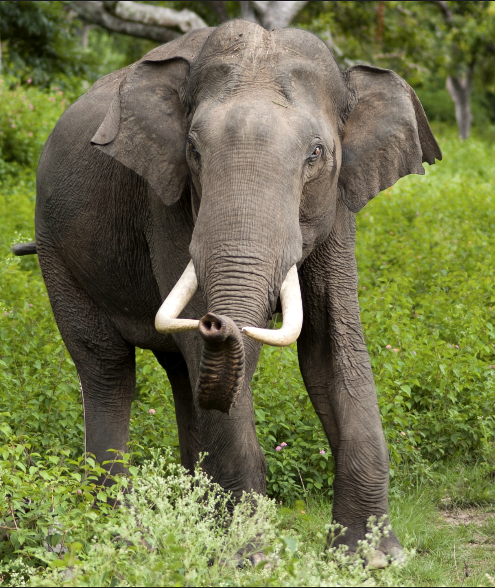
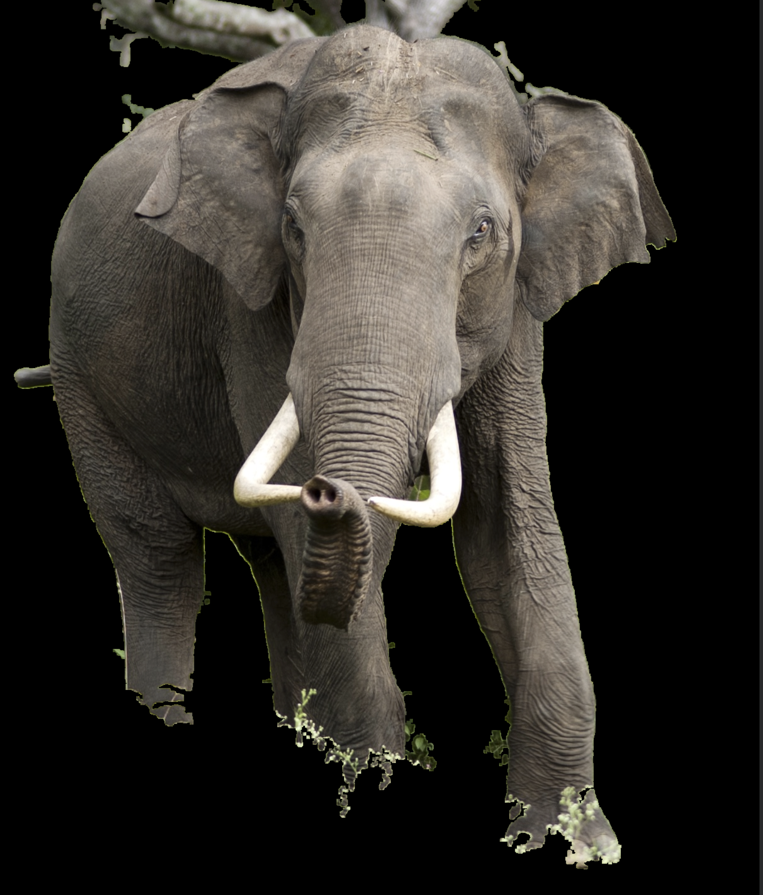
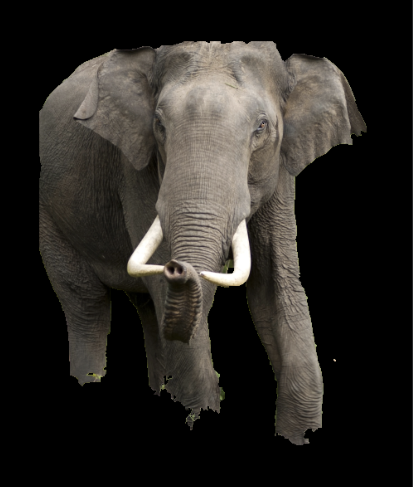

# Animal Segmentation

This repository contains two approaches for segmenting animals from their background using computer vision techniques in Python. One approach uses traditional image processing methods, and the other uses the GrabCut algorithm for more accurate segmentation.

## Project Structure

```

├── traditional_hsv.py      # Code using traditional methods for animal segmentation

├── grabcut.py          # Code using the GrabCut algorithm for animal segmentation

```

### 1. `traditional_hsv.py`

This file demonstrates how to segment an animal from its background using **traditional image processing techniques**. The steps include:

- **K-Means Clustering**: To find dominant colors in the image.

- **Color Masking**: Create a mask based on the dominant color to separate the background from the animal.

- **Gaussian Blurring**: To reduce noise in the mask.

- **Contour Detection**: To find and extract the largest contour, which is assumed to be the animal.

This method may not always be perfectly accurate, especially if the dominant background color closely matches the animal or if there are complex objects in the background.

### 2. `grabcut.py`

This file utilizes the **GrabCut algorithm**, a more advanced and accurate segmentation algorithm. The steps include:

- **GrabCut Initialization**: Define a bounding box around the object of interest (the animal), and the algorithm refines the segmentation by distinguishing between foreground (the animal) and background pixels.

- **Mask Creation**: Use the refined mask to separate the animal from the background.

- **Result**: The animal is segmented with greater precision than with traditional methods.

### Images

This folder contains sample animal images that are used in the code for segmentation. These are used to test the traditional and GrabCut methods.

## How to Run

1. **Clone the Repository**:
   ```bash
   git clone https://github.com/amandi-udawatta/Image-Segmentation-With-OpenCV.git

2. **Create a Virtual Environment:**:
   ```bash
   python3 -m venv venv

3. **Activate the Virtual Environment:**
   - On macOS/Linux:
     ```bash
      source venv/bin/activate
   - On Windows:
     ```bash
      .\venv\Scripts\activate

4. Install the Required Libraries:
    ```bash
     pip install -r requirements.txt

5. Run the traditional segmentation:
    ```bash
    python traditional_hsv.py

6. Run the grabcut segmentation:
    ```bash
    python grabcut.py

    
## Notes

- **Traditional Segmentation**: This approach might fail in cases where the background and animal have similar colors. It relies on color masking and contour detection, and accuracy can vary depending on the image.

- **GrabCut Algorithm**: This approach is more reliable and works well in complex backgrounds. However, it requires an initial bounding box to identify the region of interest.

  
## Sample Results

- **Original Image**:



- **Traditional Segmentation**:



- **GrabCut Segmentation**:



## Conclusion

This repository provides two distinct ways of performing animal segmentation. While the traditional method is faster and easier to implement, the GrabCut algorithm offers more accurate results, especially in challenging image conditions.
